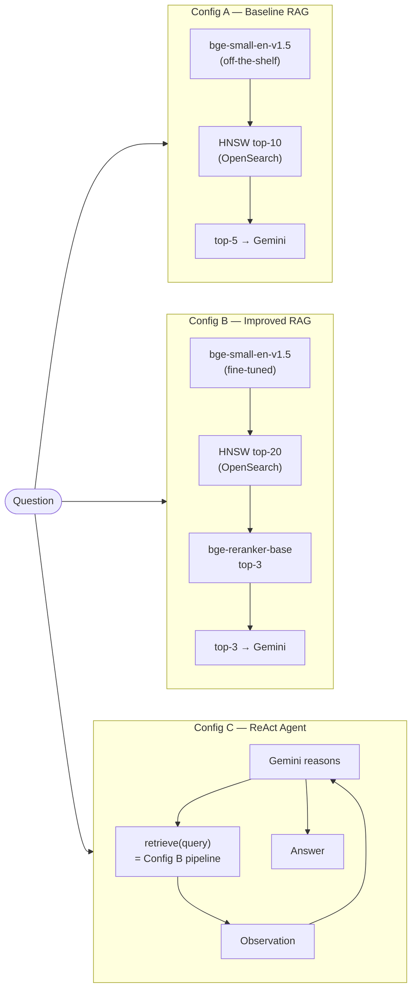
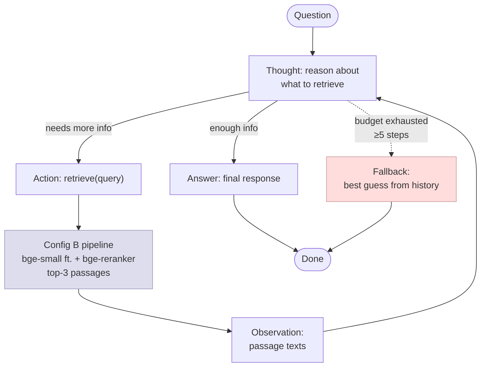

# FINAL ASSIGNMENT

## From RAG to a Tool-Using Retrieval Agent

Build and benchmark three progressively capable retrieval systems on a question-answering dataset:
- A baseline RAG pipeline: off-the-shelf embedder, naive top-k retrieval
- An improved retrieval system with a fine-tuned embedder
- An iterative-retrieval agent
---

### Benchmark & Corpus Choice

For our project we chose the HotpotQA benchmark. It uses multi-hop reasoning, which means that the questions require reasoning over multiple sentences to answer. For example:

- "What is the population of the country where the director of Inception was born?"

- Hop 1: Passage "Inception" → finds that the director is Christopher Nolan.
- Hop 2: Passage "Christopher Nolan" → finds that he was born in London, UK.
- Hop 3 (or continuation of the 2nd): Passage "United Kingdom" → finds the population.

It also uses sentence-level supporting facts, which means each context passage is split into individual sentences, and the ground truth doesn't just say "this passage is relevant": it points to the exact sentence(s) inside that passage that justify the answer. So the annotation is `(passage_title, sentence_index)`, not just `passage_title`.

Those things make the HotpotQA benchmark particularly suitable for astrophysics questions, which are often multi-hop and require reasoning over multiple sentences to answer. As an astrophysicist, this is directly relevant to my own research: real astronomy questions are routinely chains across sources (identifying an object, cross-referencing it in a catalog, then pulling a derived property from a paper that used a different naming convention entirely), so the same retrieve-then-decide loop this assignment builds is essentially the skeleton of a literature-search agent I could point at arXiv or ADS abstracts. The sentence-level supporting-facts idea matters here too: for research use, an answer is only as good as the exact sentence backing it, since that's what lets a claim be checked against the source rather than taken on faith.

We picked HotpotQA over the other three suggested benchmarks mainly because it's the most documented (as far as I could see) and widely used benchmark with the most stable tooling: the HuggingFace loader, splits, and official EM/F1 metrics all just work, which matters when the rest of the pipeline is already CPU-only and slow. The distractor setting also gives us a genuinely hard corpus for free: each question ships with 2 correct passages plus around 8 topically-related distractor passages, so retrieval is already difficult without us having to hand-build hard negatives, which directly helps Task 3a's in-batch-negative fine-tuning. We considered 2WikiMultiHopQA, but its Wikidata reasoning-chain schema is more parsing work for no real benefit at our working scale. MuSiQue is well-designed to prevent reasoning shortcuts but has less mature tooling. MultiHop-RAG's corpus (3.2K questions) is small enough that we'd be close to the assignment's stated minimum working size, and it leans on an LLM-judge for answer quality instead of EM/F1, which felt like a less stable metric to build the whole A/B/C comparison around.

**Working size**: we sampled 2,500 train questions and 500 validation questions with `random_state=42` (`src/prepare_data.py`). Their supporting-fact passages give us 5,000 (query, positive-passage) training pairs for Task 3a, and the filtered corpus, built from the union of sampled train and validation questions' context passages, comes to 28,382 passages. Training pairs are drawn exclusively from the sampled train questions and the eval set exclusively from the sampled validation questions, so there's no leakage between the two.

### Compute and model setup

**Hardware**: CPU-only laptop (Intel Core Ultra 7 165U, 14 threads, 16 GB RAM, no discrete GPU; `torch.cuda.is_available() == False`). All embedding, fine-tuning, and reranking steps run on CPU; PyTorch 2.11 was installed with a CUDA build but falls back to CPU since no NVIDIA GPU is present.

**Generator**: Google Gemini (`gemini-2.5-flash`) via the `langchain-google-genai` API, `temperature=0`, API key loaded from `.env` (`GEMINI_API_KEY`).

With no GPU available, running a local 7B+ instruction model (e.g. Llama-3.1-8B, Qwen2.5-7B) for generation was not practical: CPU-only inference at that scale would be too slow for 500 evaluation questions × 3 configurations, especially for Config C where the agent issues up to 5 sequential LLM calls per question. Gemini Flash offloads generation to the cloud while keeping local compute free for the embedding/retrieval components.

For the same reason, all locally-run models were deliberately kept small: `BAAI/bge-small-en-v1.5` (33M params) as the embedder and `BAAI/bge-reranker-base` for reranking, both from the assignment's suggested CPU-friendly options, keeping bi-encoder fine-tuning (Task 3a) and index-building tractable on CPU within reasonable time.

We also set `temperature=0` and `random_state=42` throughout (data sampling, embedder training, generation) to keep results deterministic and reproducible.

### Pipeline overview

The three configurations share the same corpus and generator but differ in how retrieval works:



### Configuration A

Configuration A uses `BAAI/bge-small-en-v1.5` (33M params) as an off-the-shelf embedder, with no fine-tuning applied. No chunking was used, since HotpotQA passages are already short (each one is built as `"{title}: {sentences}"` by concatenating the title with its sentences), so the assignment's guidance to chunk only long passages did not apply here. Passages are indexed in OpenSearch using HNSW (`nmslib` engine, `cosinesimil` space, `ef_construction=128, m=16`). Retrieval fetches the top-10 nearest neighbors by cosine similarity with no reranking; the top-5 of those are passed to the generator as context, while all 10 are kept in the output record so Recall@10 is measured over a real top-10 window instead of only the passages the generator saw (see the closing note at the end of this README). The generator is `gemini-2.5-flash` at `temperature=0`. The exact prompt template used is:

```
Answer the question using ONLY the passages below.
Be concise — one sentence or a short phrase.

Passages:
{context}

Question: {question}
Answer:
```
where `{context}` is the top-5 retrieved passages, numbered `[1]`, `[2]`, and so on.

### Configuration B

We fine-tune the same base model as Configuration A (`BAAI/bge-small-en-v1.5`) using `MultipleNegativesRankingLoss` with in-batch negatives, on 5,000 (query, positive-passage) pairs sampled from HotpotQA's train split only (`data/train_pairs.jsonl`), where the positive passage for each question is its supporting-fact passage. We train for 2 epochs, batch size 8, 100 warmup steps, `random_state=42`, and save the result to `models/finetuned_embedder/`.

We were surprised by the diagnostic Recall@5 result: on 200 held-out questions, using the bi-encoder alone with no reranking, Recall@5 actually dropped from 0.970 before fine-tuning to 0.930 after (Δ = −0.040). Fine-tuning made raw retrieval worse on this benchmark, not better: likely because the base `bge-small` model is already very well suited to Wikipedia-style QA retrieval (it's near a ceiling at 0.97 Recall@5), and 5,000 pairs at batch size 8 wasn't enough signal to improve on that without some drift. We dig into why in the Findings section below.

On top of the (worse) fine-tuned embedder we add cross-encoder reranking: the bi-encoder retrieves the top-20 candidates, and `BAAI/bge-reranker-base` re-scores all 20 as full query-passage pairs. The top-3 of the reranked list go to the generator as context; the top-10 of the same reranked list are stored as `retrieved_passage_ids` for Recall@10/MRR@10, for the same reason described for Configuration A above (only the top-3 used to be stored, which silently capped Recall@5 and Recall@10 at Recall@3; see the closing note at the end of this README). We picked reranking specifically because it doesn't depend on embedding quality the way retrieval does: since fine-tuning wasn't helping the bi-encoder, we wanted a technique that could recover precision independently. And it does: on the full evaluation set, Configuration B's combined pipeline still beats Configuration A on Answer EM (0.406 → 0.436) and Answer F1 (0.551 → 0.580), and has the best MRR@10 of all three configurations (0.945). So the reranker, not the fine-tuning, looks like what's actually driving the improvement.

### Configuration C

We built a hand-rolled ReAct loop for the agent (`src/agent.py`) instead of using smolagents, LangChain agents, or LangGraph (which we'd already used for the HW2 agent). It has one tool, `retrieve(query)`, which delegates directly to Configuration B's `retrieve_and_rerank()` (imported from `improved_retrieval.py`, not reimplemented) so the two configurations always share the exact same retrieval code path. We cap the agent at `MAX_STEPS = 5` retrieve calls per question. `agent.py` also calls Configuration B's `fine_tune()` and `build_index()` on startup (both are idempotent and skip work that already exists), so Config C can be run on its own without first running `improved_retrieval.py`. The system prompt asks the model to output exactly one of `Thought:` + `Action: retrieve("<query>")`, or `Thought:` + `Answer: <concise answer>`, at every step:

```
You are a question-answering agent with access to a retrieval tool.
To answer a question you can call retrieve() one or more times.

At each step output EXACTLY one of:
  Thought: <your reasoning>
  Action: retrieve("<query>")

OR, when you have enough information:
  Thought: <final reasoning>
  Answer: <concise answer>

Rules:
- Use retrieve() whenever you need more information.
- You may call retrieve() at most 5 times total.
- Once you write "Answer:", stop immediately.
- Be concise — answer in one sentence or a short phrase.
```

Each turn's user message is `Question: {question}\n\n{history}`, where `history` accumulates the prior `Thought → Action → Observation` steps, with each observation built from the top-3 reranked passages (the same slice the generator sees in A/B), each truncated to the first 300 characters. Each `retrieve()` call also logs the top-10 of the same reranked list into `retrieved_passage_ids`, the same top-10-for-metrics / top-3-for-context split used in A/B, though the currently saved `results/config_c_outputs.jsonl` and `src/traces/` still predate this change (see the closing note at the end of this README).



We went with a hand-rolled loop mainly because the agent only has one tool: a full framework's tool-routing and message-passing machinery doesn't buy us anything at that scale, and a plain prompt with a small regex parser (`parse_action`, `parse_answer`) keeps the step budget, the retry/backoff we had to add for Gemini API instability, and the full trace logging easy to follow. Additionally, the specific framework allowed me to better understand the working of such agents and also how to design such agents, even though it is an extremely simple agent with only one tool.

**Three worked traces**

*1. Iteration helped*: `src/traces/5a85b2ac5542991dd0999e90.json`
Question: "Brad Budde played professionally for a team in the NFL that was founded in 1960 as the Dallas Texans by who?" The agent first retrieved `"who founded dallas Texans 1960"`, which surfaced the Kansas City Chiefs / Dallas Texans connection but not the founder's name directly. It then issued a sharper follow-up, `"Lamar Hunt founded Dallas Texans"`, which confirmed the answer. Two hops, correct answer (**Lamar Hunt**): a genuine case where the first retrieval wasn't enough and the follow-up fixed it.

*2. Iteration wasn't needed*: `src/traces/5abe3f3455429976d4830aa8.json`
Question: "What company started the urban complex development that included the highrise building, The Harmon?" A single `retrieve("company started urban complex development The Harmon")` call returned a passage that already contained both facts needed (The Harmon is part of CityCenter, and CityCenter was started by MGM Resorts International), so the agent answered correctly after one step. This shows that the agent isn't retrieving more than it needs when one good hit already has the full chain.

*3. Unproductive loop*: `src/traces/5a83d7d05542992ef85e237a.json`
Question: "What is the name of the statue whose replica have been created in many landmarks world-wide such as near Pont de Grenelle in Paris?" (gold answer: **Liberty Enlightening the World**, the Statue of Liberty's official name). The agent issued six near-identical rephrasings of essentially the same query (`"statue replica near Pont de Grenelle Paris"`, `"statue replica at Pont de Grenelle Paris"`, `"statue near Pont de Grenelle Paris"`, and so on), and kept pulling back the same irrelevant `Pont de Grenelle` bridge passage and an unrelated `Umbraculum` passage every time, never diversifying its search enough to surface the Statue of Liberty passage. By the 6th step it had run out of budget; the raw, unexecuted `Action: retrieve("Statue of Liberty replica Pont de Grenelle Paris")` text got dumped as the "final answer" through the fallback path, since it never actually emitted an `Answer:` line. A clean example of looping on paraphrases instead of trying a different angle, compounded by a fallback bug: when the budget runs out mid-`Action`, the loop returns the unexecuted action string itself rather than a real (if wrong) answer.

Iteration clearly helps when the first retrieval is close but missing one fact (trace 1), and correctly does nothing when it isn't needed (trace 2), but trace 3 shows the agent has no mechanism to notice that five near-duplicate queries in a row aren't converging: it never backs off to a broader or structurally different query. We saw this pattern in 26 of the 500 questions (steps_used ≥ 4 and still wrong), which is a meaningful chunk of Configuration C's answer-quality drop discussed below.

### Evaluation results

| Config | Recall@5 | Recall@10 | MRR@10 | Answer EM | Answer F1 | SF EM | SF F1 | Joint EM | Joint F1 |
|---|---|---|---|---|---|---|---|---|---|
| Config A | 0.976 | 0.984 | 0.9231 | 0.406 | 0.5511 | 0.670 | 0.4703 | 0.380 | 0.4259 |
| Config B | 0.968 | 0.968 | 0.9447 | 0.436 | 0.5799 | 0.724 | 0.6752 | 0.410 | 0.5393 |
| Config C | 0.950 | 0.954 | 0.8840 | 0.262 | 0.4466 | 0.470 | 0.4816 | 0.152 | 0.3692 |

(500 questions per config, saved to `results/comparison_table.csv`. Recall@5/Recall@10/MRR@10 for Config A and Config B are the corrected, backfilled numbers; Config C's retrieval metrics predate the fix, though they were always comparatively less affected, since the agent's multi-step loop already accumulated more than 3 ids across multiple retrieve calls on most questions. Answer EM/F1, SF EM/F1, and Joint EM/F1 are unchanged from before the fix for all three configs, since they never depended on the length of `retrieved_passage_ids`. SF EM/F1 here is a passage-level approximation of HotpotQA's official sentence-level Supporting-Facts metric: we only track which passages were retrieved, not which sentences inside them, so it measures the same idea at coarser granularity.)

With the fix in place, Configuration A does still show a marginally higher raw Recall@5 and Recall@10 than Configuration B (0.976/0.984 vs 0.968/0.968), the same direction as before the bug was found, but this is now a like-for-like comparison (both are genuine top-5/top-10 windows) rather than an artifact of one config's list being silently truncated to 3 entries. See "Findings and error analysis" below for what that means alongside the answer-quality metrics.

We also ran a RAGAS deep-dive on Configuration B, since it's the best-performing configuration on Answer EM/F1, MRR@10, and Joint F1, even though Configuration A edges it out on raw Recall@5/10. We used `gemini-2.5-flash` as the judge LLM (same model as our generator) and `text-embedding-004` for the embedding-based metrics, evaluated on 50 questions to keep API cost and rate-limit exposure manageable (`results/ragas_scores.json`):

| Metric | Score |
|---|---|
| Faithfulness | 0.88 |
| Context Precision | 0.4067 |
| Context Recall | 0.60 |

Faithfulness is high, meaning the generated answers mostly stick to what's actually in the retrieved passages rather than hallucinating. Context Precision is much lower, telling us a fair share of the top-3 reranked passages aren't directly relevant to the question even when the final answer comes out correct: the generator is good at ignoring irrelevant context, but the retrieval pipeline is still bringing in noise. Context Recall at 0.60 suggests the truly relevant passage isn't always among the top-3 kept after reranking, consistent with Configuration B's Recall@5 of 0.968 measured over a wider top-5 window than what the generator actually saw.

### Findings and error analysis

**Which configuration performed best, and by how much.** Configuration B wins on every answer-quality metric: Answer EM (+0.030 over A), Answer F1 (+0.029), MRR@10 (+0.022), SF F1 (+0.205), and Joint F1 (+0.113). Configuration A shows a marginally higher raw Recall@5/10 in the table above (0.976/0.984 vs 0.968/0.968), and unlike in an earlier draft of this table, that comparison is now verified: both configs' `retrieved_passage_ids` reflect a genuine top-10 ranking, not one config's list being silently truncated to 3 entries. So Config A really does retrieve the correct passage slightly more often in a raw top-k sense; Config B still wins on every metric that measures what the generator actually did with what it was given, which is the more relevant number for a QA system. Configuration C is worse than both A and B across every metric, including retrieval metrics that are close in absolute terms to Configuration B's (Recall@5 0.950 vs 0.968, MRR@10 0.884 vs 0.945) but with a much larger gap in answer quality (Answer EM 0.262 vs 0.436, a 0.174 drop).

**Did embedder fine-tuning help, and how much did the architectural technique add on top?** Fine-tuning alone did not help: the diagnostic Recall@5 on the bi-encoder went down (0.970 → 0.930), not up, the opposite of what Task 3a expects to see. The cross-encoder reranking layered on top is what turns this around: despite starting from a worse bi-encoder, Configuration B's full pipeline ends up with better answer quality than Configuration A's un-reranked top-5. That means the reranker is compensating for, and then some, the fine-tuning regression rather than the two techniques stacking additively. If we had to keep only one of the two, reranking alone (skipping fine-tuning entirely) looks like it would have been the stronger choice on this benchmark.

**Did iterative retrieval help, or add noise?** Mostly noise, on this benchmark. Configuration C's retrieval quality is only slightly behind Configuration B's, but its answer quality collapses: Answer EM drops from 0.436 to 0.262, a much bigger relative drop than the retrieval numbers alone would suggest. Looking at the 26 questions where the agent used 4 or more steps and still got the answer wrong (trace 3 above is one of them), the failure mode is rarely "the agent never found the right passage": it's the agent looping on paraphrases of the same query without changing strategy, and then, when it runs out of step budget mid-action, falling back to returning the literal unexecuted `Action: retrieve(...)` string as its "answer" instead of a real guess. That's a bug in the fallback path (`run_agent()` in `src/agent.py`) as much as it is a finding about iterative retrieval: a chunk of Configuration C's score is lost to malformed non-answers rather than genuinely wrong reasoning. Even accounting for that, the core pattern holds: giving the agent more chances to retrieve did not reliably translate into better answers on a benchmark where a single well-chosen top-5 retrieval (Configuration A) or top-3 reranked retrieval (Configuration B) already gets it right most of the time.

**Error analysis on specific questions:**

- `5a83d7d05542992ef85e237a` (Configuration C, wrong): the Statue of Liberty question from trace 3 above. Six near-duplicate query rephrasings, no diversification, budget exhausted mid-action. A clear iteration-gone-wrong case.
- `5ab58ee6554299488d4d99d6` (Configuration C, wrong): predicted "David Faustino was born on March 3, 1974" against gold "February 13, 1946", not a near-miss, a different date and implicitly a different fact entirely, suggesting the agent anchored on the wrong entity partway through its retrieval chain.
- `5ae5a63c5542992663a4f203` (Configuration C, EM-wrong but arguably correct): predicted "The nickname of the regional dialect from Newcastle upon Tyne, where Tomi Ameobi was born, is Geordie." against gold "Geordie", semantically right but fails exact-match because the model didn't follow its own "be concise" instruction. A chunk of Configuration C's low EM (0.262) is this kind of verbosity penalty rather than a factual error, which the stricter token-F1 (0.447) partially, but not fully, forgives.
- `5add64065542995b365fab25` (Configuration C, same verbosity pattern): predicted "Lavinia Greenlaw and Nâzım Hikmet are both poets and novelists." against gold "poet and novelist", again correct content, wrong format, same systematic issue as above.
- `5a85b2ac5542991dd0999e90` (Configuration C, correct): the Lamar Hunt / Dallas Texans question from trace 1 above, a genuine two-hop success, included as the counter-example to show iteration isn't uniformly bad, just unreliable.

### Interactive querying

After running the pipeline, you can ask your own questions using `src/query.py`:

```bash
poetry run python Final_HW/src/query.py -q "YOUR QUESTION" --config B
```

**Flags**

| Flag | Values | Default | Description |
|------|--------|---------|-------------|
| `-q` / `--question` | any string | — | The question to ask (required) |
| `-c` / `--config` | `A`, `B`, `C` | `B` | Which configuration to use |
| `--show-passages` | — | off | Print the retrieved passages alongside the answer |

> **Scope note**: the corpus contains ~28 k Wikipedia passages drawn from the HotpotQA distractor setting. Questions firmly inside that space (people, films, cities, historical events) work well. Questions outside it still get an answer — whatever the retriever finds closest — but treat those results as best-effort.

**Example 1 — simple factual (birthplace)**

```bash
poetry run python Final_HW/src/query.py \
  -q "Where was Christopher Nolan born?" \
  --config B --show-passages
```

Expected output (approximately):

```
────────────────────────────────────────────────────────────
Config B  |  Where was Christopher Nolan born?
────────────────────────────────────────────────────────────
Loading Config B (fine-tuned embedder + cross-encoder reranker) …

Answer: Christopher Nolan was born in London, England.

Retrieved passages:
  [1] Christopher Nolan
      Christopher Nolan: Christopher Edward Nolan CBE is a British-American film director…

  [2] Inception
      Inception: Inception is a 2010 science fiction action film written and directed by
      Christopher Nolan…
```

**Example 2 — astronomy (southern-hemisphere constellation)**

```bash
poetry run python Final_HW/src/query.py \
  -q "What is the most famous constellation visible only from the southern hemisphere?" \
  --config C
```

Expected output (approximately):

```
────────────────────────────────────────────────────────────
Config C  |  What is the most famous constellation visible only from the southern hemisphere?
────────────────────────────────────────────────────────────
Loading Config C (ReAct agent) …

Answer: Crux (the Southern Cross)
Retrieve calls used: 2
```

Config C is useful for questions that require chaining two facts: the agent will issue a first `retrieve()` call for the constellation, then a follow-up for visibility constraints if the first hit didn't settle it.

### Installation and execution

**1. Clone the repository**

```bash
git clone https://github.com/dim-papach/AI-Handson-Assigments.git
cd AI-Handson-Assigments
```

**2. Install dependencies**

Using Poetry (recommended):
```bash
poetry install
```

Using venv:
```bash
python3 -m venv venv
source venv/bin/activate
pip install -r Final_HW/requirements.txt
```

**3. Configure environment variables**

Create a `.env` file in the repository root with your Gemini API key:
```env
GEMINI_API_KEY="your_key_here"
```

**4. Start OpenSearch**

```bash
cd Final_HW
docker compose up -d
```

Wait for the container to report healthy (`docker ps` should show `Up ... (healthy)`), then confirm it's reachable:
```bash
curl "http://localhost:9200/_cluster/health"
```

**5. Run the pipeline, in order**

```bash
# Task 1: build corpus / train pairs / eval set from HotpotQA
poetry run python Final_HW/src/prepare_data.py

# Task 2: Configuration A (baseline RAG)
poetry run python Final_HW/src/baseline_rag.py

# Task 3: Configuration B (fine-tune embedder, then retrieve + rerank)
poetry run python Final_HW/src/improved_retrieval.py

# Task 4: Configuration C (iterative-retrieval agent)
poetry run python Final_HW/src/agent.py

# Task 5: evaluate all three configurations, write comparison table + RAGAS scores
poetry run python Final_HW/src/evaluate.py
```

Each pipeline script is resumable: it skips questions already present in its `results/config_*_outputs.jsonl` output, so a run that gets interrupted (or a Gemini API hiccup) can just be restarted with the same command. Index-building and fine-tuning are similarly idempotent: `improved_retrieval.py` skips rebuilding an OpenSearch index or retraining the embedder if they already exist. `agent.py` now calls the same `fine_tune()`/`build_index()` functions on startup, so it can also be run directly, on its own, without running `improved_retrieval.py` first; running the two in the documented order simply means Config C reuses work Config B already did instead of redoing it.

**Note on the RAGAS import workaround**: `ragas==0.4.3` imports `langchain_community.chat_models.vertexai`, a module that no longer exists in the `langchain-community` version this project pins (`0.4.2`; the package deprecated and removed that submodule). `evaluate_ragas()` in `src/evaluate.py` works around this by registering an empty stub module under that import path in `sys.modules` before importing `ragas`, so the broken import resolves to a harmless placeholder class instead of crashing. This only affects the RAGAS deep-dive (Task 5.3, optional); Tasks 5.1 and 5.2 don't touch `ragas` at all. `evaluate.py` also skips the RAGAS call entirely if `results/ragas_scores.json` already exists, so re-running the evaluation script doesn't repeat the judge-LLM calls.

**Expected outputs**: after a full run, you should have `results/config_a_outputs.jsonl`, `results/config_b_outputs.jsonl`, `results/config_c_outputs.jsonl` (500 lines each), `results/comparison_table.csv`, `results/ragas_scores.json`, `models/finetuned_embedder/` (the fine-tuned bi-encoder), and `src/traces/` populated with one JSON trace per evaluation question.

**Why the recall-id backfill was needed.** `baseline_rag.py` and `improved_retrieval.py` originally only saved the passages actually shown to the generator as `retrieved_passage_ids` (5 for Config A, 3 for Config B after reranking), so `Recall@10` was numerically identical to `Recall@5` for both, and Config B's "Recall@5" was really a Recall@3. Both scripts were fixed to store a real top-10 ranking in `retrieved_passage_ids` for Recall@10/MRR@10, alongside a new `context_passage_ids` field holding only the top-5 / top-3 that actually went to the generator (used by SF EM/F1 and the RAGAS contexts, since those need what the answer was based on, not the wider recall window). `results/config_a_outputs.jsonl` and `results/config_b_outputs.jsonl` were then backfilled in place by recomputing retrieval/reranking locally, no Gemini calls, since `predicted_answer` never changes when the generator's context doesn't. Config C was intentionally left un-backfilled: its saved traces only ever captured the top-3 passages per `retrieve()` call, so fixing its Recall@10 the same way would require an actual, costlier agent re-run rather than a local recomputation.
