For our project we are using the HECATE galaxy catalogue, which is a catalogue of galaxies (Kovlakas K., Zezas A., Andrews J. J., Basu-Zych A., Fragos T., Hornschemeier A., Kouroumpatzakis K., Lehmer B., Ptak. A (2021). “The Heraklion Extragalactic Catalogue (HECATE): a value added galaxy catalogue for multi-messenger astrophysics”. MNRAS in press.ADS link)

You can download the catalogue from [Kaggle](https://www.kaggle.com/datasets/tanmayshukla05/hecate-galaxy-catalogue?resource=download) or from the original [source](https://hecate.ia.forth.gr/catalog.php), and it is stored in the `data/` folder as `HECATE.csv`.

For my project I choose a classification task, where I want to predict the nuclear activity classification of galaxies. This is usefull, since for our analysis we usally classify galaxies based on their nuclear activity.

However since many of the galaxies do not have a reliable measurement of their nuclear activity, the completness of our sample is not good, especially for near and very distant galaxies (the near galaxies can are usually not well documented and the very distant galaxies are too faint to be observed ).

The target variable is `CLASS_SP`, which is the nuclear activity classification of galaxies. It is a categorical variable with the following values:

- 0: star-forming
- 1: Seyfert
- 2: LINER
- 3: composite
- -1: unknown


## Dataset Description

```python
import pandas as pd

df = pd.read_csv("data/HECATE.csv")

print("Number of rows:", len(df))
print("Number of columns:", len(df.columns))
```

Since the dataset is quite large and most of the columns are not necessary for our analysis, we will only be using a subset of the columns for our analysis. We will be using the following columns:

1. `logM_HEC`: Decimal logarithm of the total stellar mass in solar masses.
1. `logSFR_HEC`: Decimal logarithm of the homogenised star-formation rate in solar masses per year.
1. `CLASS_SP`: Nuclear activity classification using the method in Stampoulis et al. 2019: 0=star-forming, 1=Seyfert, 2=LINER, 3=composite, -1=unknown.
1. `AGN_HEC`: Adopted activity classification based on the combination of class_sp and agn_s17: Y=AGN, N=non-AGN, ?=unknown.
1. `T`: Numerical Hubble-type following the de Vaucouleurs et al. 1976 system.
1. `WF1`: 3.3μm-band (W1) apparent magnitude in the WISE forced photometry catalog (mag).
1. `WF2`: 4.6μm-band (W2) apparent magnitude in the WISE forced photometry catalog (mag).
1. `WF3`: 12μm-band (W3) apparent magnitude in the WISE forced photometry catalog (mag).
1. `WF4`: 22μm-band (W4) apparent magnitude in the WISE forced photometry catalog (mag).
1. `U`: u-band SDSS apparent magnitude (mag).
1. `R`: r-band SDSS apparent magnitude (mag).
1. `G`: g-band SDSS apparent magnitude (mag).
1. `I`: i-band SDSS apparent magnitude (mag).
1. `Z`: z-band SDSS apparent magnitude (mag).
1. `UT`: Total U-band apparent magnitude (mag).
1. `BT`: B-band apparent magnitude (mag).
1. `VT`: V-band apparent magnitude (mag).
1. `IT`: I-band apparent magnitude (mag).

These columns will allow us to study the connections between star formation, metallicity, Hubble type, and AGN activity. We will also use the WISE W1 and W3 bands together with the UV and optical magnitudes to investigate galaxy spectral properties.

To support this, we will create the color indices `u-g` and `g-r`. Galaxy colors are useful because younger, star-forming systems tend to be bluer, while older, more evolved galaxies are redder.

The WISE W1 and W3 bands are particularly helpful for this analysis. The `W3-UT` color can trace hidden star formation from dust-obscured regions, while the `(W3 + UV)/W1` color can serve as a proxy for the stage of star formation in the galaxy (high ratio indicates ongoing star formation).

We use both the total apparent magnitudes and the SDSS apparent magnitudes, since they are measured differently and can provide different information about the galaxy.

# Reducing the dataset

Before we move on to the analysis, we will sneak a quick peak into the data to understand the distribution of the data and identify any potential issues.

The final preprocessing will be done in the `preprocessing.py` script, but we will modify the dataset here to create the reduced dataset that we will use for our analysis. We will also check the distribution of the key columns and the color indices to understand the data better.

Why are we doing this?:
- Because we want to make sure that the data we are using for our analysis is reliable and that we are not including any data points that have large errors. This will help us to get more accurate results from our analysis and to avoid any biases that may arise from including unreliable data points.
- The HECATE catalogue contains a large number of data points, but not all of them are reliable or even usefull for analysis. By reducing the dataset to only include data points with reliable measurements, we can ensure that our analysis is based on high-quality data and that our results are more robust.
- Since we can create a synthetic dataset for the homework, we can afford to be more selective with the data points we include in our analysis, if we are careful to maintain a large enough sample size for our analysis and not introduce any biases by excluding certain types of galaxies or measurements. 


```python
import matplotlib.pyplot as plt
import seaborn as sns
import numpy as np

plt.style.use('bmh')
plt.rcParams["axes.prop_cycle"] = plt.cycler("color", plt.cm.viridis(np.linspace(0, 1, 4)))

# New columns for the color indices
df['u-g'] = df['U'] - df['G']
df['g-r'] = df['G'] - df['R']
df['W3-UT'] = df['WF3'] - df['UT']
df['(W3+UT)/W1'] = (df['WF3'] + df['UT']) / df['WF1']

# Check the distribution of the key columns
key_columns_with_errors = ['T', 'WF1','WF2', 'WF3', 'WF4', 'UT', 'BT', 'VT','IT', 'U', 'R', 'G', 'R', 'I', 'Z']
error_columns = ['E_T', 'E_WF1','E_WF2', 'E_WF3', 'E_WF4', 'E_UT', 'E_BT', 'E_VT', 'E_IT', 'E_U', 'E_R', 'E_G']


key_columns_with_no_errors = ['CLASS_SP', 'AGN_HEC', 'logM_HEC', 'logSFR_HEC']
key_columns_with_flags = ['METAL']
flag_columns = ['FLAG_METAL']

key_columns = key_columns_with_errors + key_columns_with_no_errors + key_columns_with_flags

color_columns = ['u-g', 'g-r', 'W3-UT', '(W3+UT)/W1']

df_key_columns= df[key_columns+color_columns]
```


```python
# Distribution of the key columns
df.hist(column=key_columns_with_errors, bins=30, figsize=(15, 10))
plt.suptitle('Distribution of Key Columns')
plt.show()
```

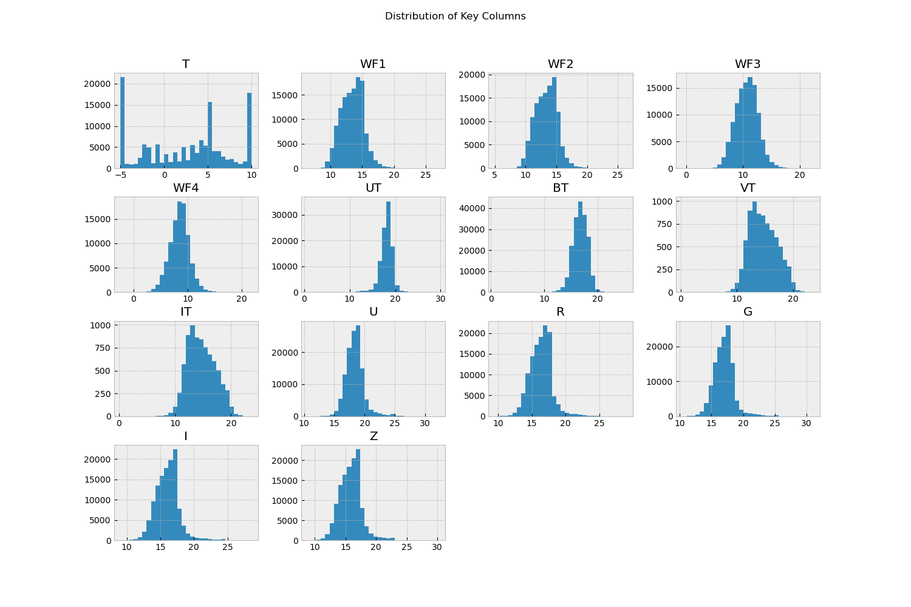

As we can see most of the distributions are skewed, which is why we will imputate the NaN values with the median of the column.

```python
#| label: fig-key-columns-with-no-errors

df.hist(column=key_columns_with_no_errors, bins=30, figsize=(15, 10))
plt.suptitle('Distribution of Key Columns with Flags')
plt.show()
```

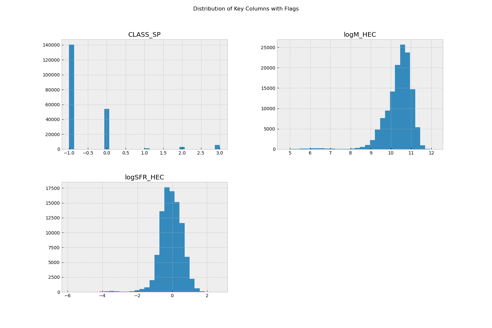

Most of our galaxies are of Class -1, which means they are unknown (Explaining the problem from the introduction better). Because of this, we will have to remove the data points with Class -1 from our dataset.

```python
df.hist(column=color_columns, bins=30, figsize=(15, 10))
plt.suptitle('Distribution of Color Indices')
plt.show()
```

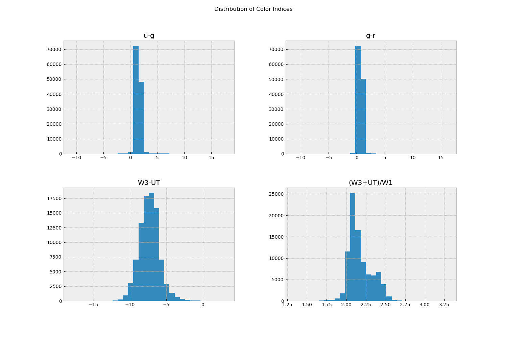


## Error Ratios

```python
# check if e_* has any zero values to avoid division by zero
for err_col in error_columns:
    if (df[err_col] == 0).any():
        print(f"Warning: Column {err_col} contains zero values. These will be ignored in the ratio calculation.")
    else:
        print(f"Column {err_col} does not contain zero values.")
```


```python
# New ratio df
ratio_df = pd.DataFrame()
for key_col, err_col in zip(key_columns_with_errors, error_columns):
    ratio_col_name = f"{key_col}_ratio"
    ratio_df[ratio_col_name] = np.abs(df[key_col] / df[err_col])*100
    print(f"Calculated ratio for {key_col} and {err_col} as {ratio_col_name}")

ratio_df.describe()
```

```python
ratio_df.hist(bins=30, figsize=(15, 10))
plt.suptitle('Distribution of Key Column to Error Ratios')
plt.show()
```

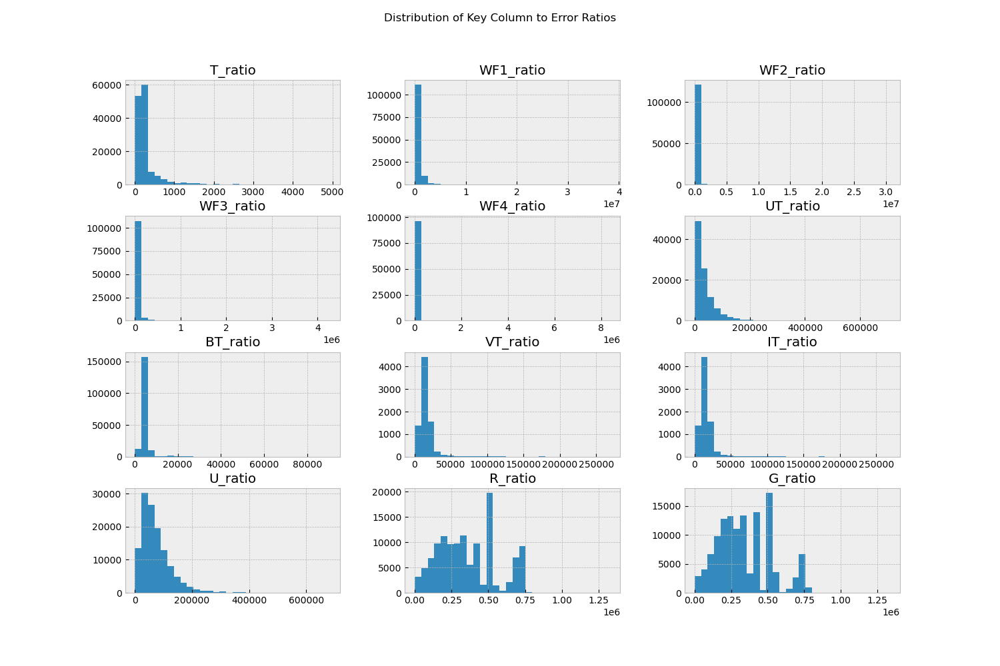

As we can see we have most galaxies with a Magnitude to Error ratio greater than 3. This means that these galaxies have reliable measurements. We will keep only the data points with a Magnitude to Error ratio greater than 3.

```python
# if ratio is less than 3, we will ignore those data points
for ratio_col in ratio_df.columns:
    ratio_df_reduced = ratio_df[ratio_df[ratio_col] > 3]  # keeping only data points with ratio greater than 3
ratio_df_reduced.count()
```

## Metallicity

The metallicity of a galaxy is an important property that can provide insights into its formation and evolution. However, the metallicity measurements in our dataset have a flag column that indicates whether the measurement is reliable or not. We will check the distribution of the metallicity values and the flags to understand how many data points we can use for our analysis.

```python
# Check the distribution of metallicity and its flag
plt.figure(figsize=(10, 5))
plt.subplot(1, 2, 1)
sns.histplot(df['METAL'], bins=30, kde=True)
plt.title('Distribution of Metallicity')
plt.xlabel('Metallicity')
plt.ylabel('Frequency')

plt.subplot(1, 2, 2)
sns.histplot(df['FLAG_METAL'], bins=30, kde=False)
plt.title('Distribution of Metallicity Flags')
plt.xlabel('Flag Value')
plt.ylabel('Frequency')

plt.tight_layout()
plt.show()

plt.figure(figsize=(10, 6))

# Grouping by 'FLAG_METAL'
sns.histplot(data=df, x='T', hue='FLAG_METAL', bins=30, kde=True, 
             element="step", palette="viridis")

plt.title('Distribution of Metallicity Grouped by Flag Value')
plt.xlabel('Metallicity (12+log(O/H))')
plt.ylabel('Frequency')
plt.grid(axis='y', alpha=0.3)
plt.show()
```

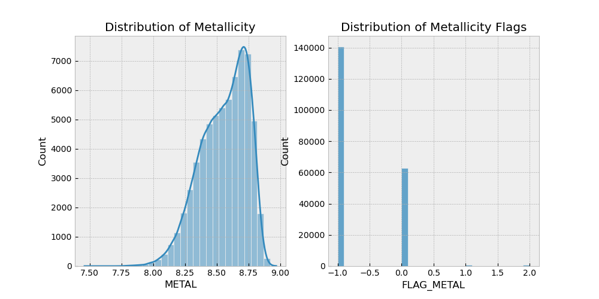
c

With the flags being:

- -1=missing

- 0=reliable

- 1=O3N2 ratio >2 (outside the PP04 range)

- 2=low signal-to-noise ratio (<3 for the weakest line).

Since the metallicity flags -1 and 0 follow a similar distribution for different Hubble types and the flags 1 and 2 correspond to a small number of data points, we can cut the datapoints with flags -1 without being biased towards a specific type of galaxy. This is why we will keep only 0.5% of the data points with flag -1, to simulate the effect of having missing data but without losing the important information that the metallicity measurements provide for our analysis.

```python
# Separate the -1 flags from the rest
df_flag_minus_1 = df[df['FLAG_METAL'] == -1]
df_others = df[df['FLAG_METAL'] != -1]

# Sample 2% of the -1 flags
df_flag_minus_1_reduced = df_flag_minus_1.sample(frac=0.005, random_state=42)

# Combine them back together
df_metal_reduced = pd.concat([df_others, df_flag_minus_1_reduced])

# Verify the new distribution
print(df_metal_reduced['FLAG_METAL'].value_counts())
```

## Reduced dataset
```python
# reduce the original df to only include rows where all key column to error ratios are greater than 3 and only include 0.5% of the data points with flag -1 
# First, we will create a mask for the ratio conditions
ratio_mask = np.ones(len(df), dtype=bool)
for ratio_col in ratio_df.columns:
    df_reduced = df_key_columns[ratio_df[ratio_col] > 3]
# Then, we will create a mask for the metallicity flag condition
metal_mask = (df['FLAG_METAL'] != -1) | ((df['FLAG_METAL'] == -1) & (df.index.isin(df_flag_minus_1_reduced.index)))
# Finally, we will combine the masks to create the reduced dataset
df_reduced = df[ratio_mask & metal_mask]
df_reduced = df_reduced[key_columns + color_columns]
df_reduced.info()
```

Now that we have a reduced dataset with reliable measurements, we can proceed with our analysis. 

```python
print("Original dataset shape:", df.shape)
print("Reduced dataset shape:", df_reduced.shape)
```
It is important to note that the reduced dataset still contains a large number of data points, more than 8,000 rows and 8 columns, as required from our project.

# Preprocessing

To begin with, we drop the columns that are not useful for our analysis and we remove the rows with no class label. We also drop most of the rows with metallicity flag -1, since they are not reliable (keep 0.5% of them to simulate noise).

After, we spit the data into train, validation and test sets(80%, 10%, 10%) and:
- we encode the target variable using Label Encoding.
- We cap the outliers using the IQR method. 
- We imputate the NaN values using the median of the column.
- We filter out the data with an Error Ratio Magnitude/Error< 3.
- We calculate the new colors as explained in the introduction.
- We scale the data using the Standard Scaler, since we don't have any outliers after the treatment (Robust Scaler) and our data are not bound or uniformly distributed (MinMax Scaler).


## Imbalance Problem

As shown by @fig-key-columns-with-no-errors, the dataset is imbalanced. Even without the Class -1 galaxies, we have a lot of galaxies of Class 0, which means they are Star Forming Galaxies. 

```python
# Drop class -1 galaxies
df_reduced = df_reduced[df_reduced['CLASS_SP'] != -1]

# Check the percentages of the target variable
print("Percentage of each class in the reduced dataset:")
print(df_reduced['CLASS_SP'].value_counts(normalize=True) * 100)
```

Usually, the solution to this problem is to use SMOTE or RandomUnderSampler, however we will use a hybrid solution to this problem. We will use Undersampling for the majority class and SMOTE for the minority class. My final dataset should not be more than 10% larger from the original. 

The reason for using this hybrid approach is to avoid the information loss that comes with undersampling and the overfitting that can come with oversampling/creation of synthetic and duplicate datapoints.

# PCA

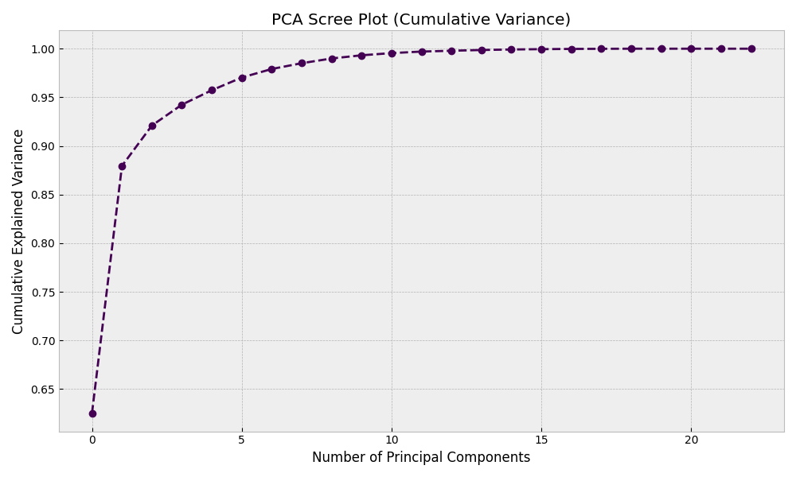
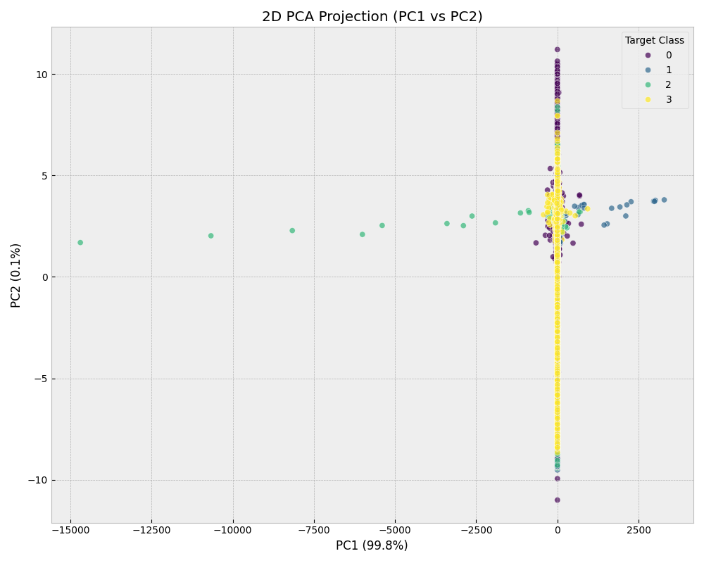

| Feature | PC1 | PC2 | PC3 | PC4 | PC5 | PC6 | PC7 | PC8 | PC9 | PC10 | PC11 | PC12 | PC13 | PC14 | PC15 | PC16 | PC17 | PC18 | PC19 | PC20 | PC21 | PC22 |
| --- | --- | --- | --- | --- | --- | --- | --- | --- | --- | --- | --- | --- | --- | --- | --- | --- | --- | --- | --- | --- | --- | --- |
| T | 0.09 | -0.21 | 0.22 | 0.07 | 0.49 | 0.11 | 0.79 | 0.04 | -0.11 | -0.05 | 0.06 | -0.03 | 0.01 | 0.01 | -0.01 | 0.00 | 0.00 | 0.00 | 0.00 | 0.00 | 0.00 | 0.00 |
| WF1 | 0.28 | -0.03 | -0.01 | 0.00 | 0.02 | 0.10 | -0.05 | 0.05 | -0.02 | 0.07 | -0.12 | 0.18 | 0.24 | -0.12 | -0.18 | 0.04 | -0.02 | 0.86 | 0.00 | -0.00 | 0.00 | -0.00 |
| WF2 | 0.28 | -0.03 | -0.04 | 0.03 | 0.04 | 0.07 | -0.04 | 0.08 | -0.04 | 0.07 | -0.14 | 0.18 | 0.29 | -0.34 | 0.79 | -0.09 | 0.02 | -0.13 | -0.00 | 0.00 | -0.00 | -0.00 |
| WF3 | 0.21 | 0.11 | -0.26 | 0.20 | 0.12 | 0.09 | -0.07 | -0.06 | -0.31 | 0.07 | -0.01 | 0.08 | 0.18 | -0.08 | -0.28 | -0.00 | 0.00 | -0.23 | 0.70 | 0.18 | -0.00 | -0.05 |
| WF4 | 0.17 | 0.14 | -0.32 | 0.26 | 0.17 | -0.12 | 0.02 | 0.52 | 0.53 | 0.14 | 0.40 | -0.02 | -0.07 | 0.00 | -0.02 | 0.00 | 0.00 | -0.01 | -0.00 | 0.00 | -0.00 | 0.00 |
| UT | 0.25 | 0.15 | -0.11 | -0.28 | 0.05 | -0.07 | 0.03 | -0.10 | 0.01 | -0.02 | 0.06 | -0.19 | 0.47 | -0.37 | -0.38 | 0.03 | 0.00 | -0.28 | -0.41 | -0.11 | 0.00 | 0.03 |
| BT | 0.27 | 0.08 | -0.05 | -0.19 | 0.03 | -0.00 | -0.03 | -0.02 | -0.02 | -0.12 | 0.08 | -0.09 | 0.40 | 0.81 | 0.16 | 0.05 | 0.00 | -0.01 | -0.00 | 0.00 | 0.00 | -0.00 |
| VT | 0.07 | 0.55 | 0.40 | 0.19 | -0.02 | -0.01 | 0.03 | 0.00 | -0.00 | -0.01 | -0.01 | 0.02 | -0.00 | -0.01 | -0.00 | -0.00 | -0.00 | 0.00 | -0.00 | -0.01 | -0.71 | 0.01 |
| IT | 0.07 | 0.55 | 0.40 | 0.19 | -0.02 | -0.01 | 0.03 | 0.00 | -0.00 | -0.01 | -0.01 | 0.02 | -0.00 | -0.01 | -0.00 | -0.00 | -0.00 | 0.00 | 0.00 | 0.01 | 0.71 | -0.01 |
| U | 0.25 | 0.15 | -0.12 | -0.29 | 0.09 | -0.05 | 0.04 | -0.08 | -0.00 | 0.06 | -0.08 | 0.09 | -0.32 | 0.03 | -0.00 | -0.30 | -0.12 | 0.01 | 0.05 | -0.37 | -0.00 | -0.66 |
| R | 0.29 | 0.02 | -0.00 | -0.15 | 0.04 | 0.04 | -0.05 | 0.01 | -0.04 | -0.04 | -0.03 | -0.10 | -0.27 | 0.00 | -0.01 | -0.31 | -0.13 | 0.00 | 0.16 | -0.42 | 0.01 | 0.70 |
| G | 0.28 | 0.06 | -0.04 | -0.21 | 0.04 | 0.01 | -0.02 | 0.01 | -0.05 | -0.14 | 0.01 | 0.02 | -0.29 | -0.01 | -0.01 | -0.31 | -0.13 | 0.01 | -0.20 | 0.78 | -0.01 | 0.06 |
| I | 0.29 | 0.01 | 0.01 | -0.12 | 0.03 | 0.05 | -0.05 | 0.00 | -0.03 | -0.04 | -0.04 | -0.09 | -0.28 | -0.02 | 0.01 | 0.26 | 0.86 | -0.01 | -0.00 | 0.00 | -0.00 | -0.00 |
| Z | 0.29 | -0.01 | 0.01 | -0.09 | 0.03 | 0.06 | -0.06 | 0.00 | -0.03 | -0.02 | -0.05 | -0.07 | -0.27 | -0.05 | 0.07 | 0.77 | -0.46 | -0.06 | 0.00 | -0.00 | 0.00 | 0.00 |
| logM_HEC | -0.22 | 0.08 | 0.02 | -0.05 | 0.68 | 0.25 | -0.37 | -0.00 | 0.27 | -0.28 | -0.35 | 0.00 | 0.04 | -0.00 | -0.03 | -0.00 | 0.00 | -0.02 | -0.00 | 0.00 | -0.00 | 0.00 |
| logSFR_HEC | -0.15 | -0.03 | 0.28 | -0.35 | 0.28 | 0.14 | -0.29 | 0.17 | -0.32 | 0.42 | 0.53 | 0.08 | 0.01 | -0.03 | 0.03 | 0.01 | 0.00 | 0.02 | 0.00 | -0.00 | 0.00 | -0.00 |
| METAL | -0.11 | 0.04 | -0.01 | -0.10 | 0.10 | -0.56 | -0.02 | 0.59 | -0.38 | -0.04 | -0.37 | -0.14 | 0.03 | 0.01 | -0.02 | 0.03 | 0.00 | 0.02 | 0.00 | -0.00 | 0.00 | 0.00 |
| AGN_HEC | -0.23 | 0.28 | -0.24 | -0.24 | -0.27 | 0.66 | 0.23 | 0.40 | -0.09 | -0.02 | -0.13 | -0.12 | 0.00 | -0.01 | 0.01 | 0.01 | 0.00 | 0.01 | 0.00 | -0.00 | 0.00 | 0.00 |
| u-g | -0.16 | 0.25 | -0.23 | -0.20 | 0.13 | -0.16 | 0.21 | -0.25 | 0.17 | 0.64 | -0.31 | 0.19 | -0.03 | 0.12 | 0.03 | 0.11 | 0.05 | -0.01 | -0.02 | 0.12 | 0.00 | 0.22 |
| g-r | -0.17 | 0.19 | -0.17 | -0.24 | 0.01 | -0.18 | 0.13 | -0.01 | -0.07 | -0.46 | 0.24 | 0.69 | -0.01 | -0.05 | 0.01 | 0.15 | 0.05 | 0.01 | 0.03 | -0.08 | 0.00 | 0.13 |
| W3-UT | 0.08 | 0.02 | -0.26 | 0.49 | 0.13 | 0.18 | -0.12 | -0.00 | -0.43 | 0.11 | -0.06 | 0.25 | -0.13 | 0.18 | -0.08 | -0.02 | -0.00 | -0.09 | -0.52 | -0.14 | 0.00 | 0.04 |
| (W3+UT)/W1 | -0.20 | 0.29 | -0.37 | 0.07 | 0.19 | -0.13 | 0.04 | -0.31 | -0.24 | -0.14 | 0.27 | -0.49 | -0.06 | -0.12 | 0.28 | 0.02 | -0.00 | 0.30 | 0.00 | -0.00 | 0.00 | -0.00 |


# Classical Models

We use 5 classical models to solve this problem:

- Logistic Regression
- Random Forest
- Support Vector Machine
- Decision Tree
- Xgboost

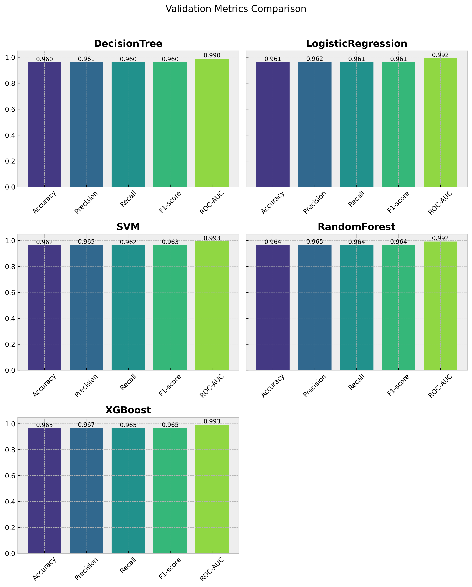
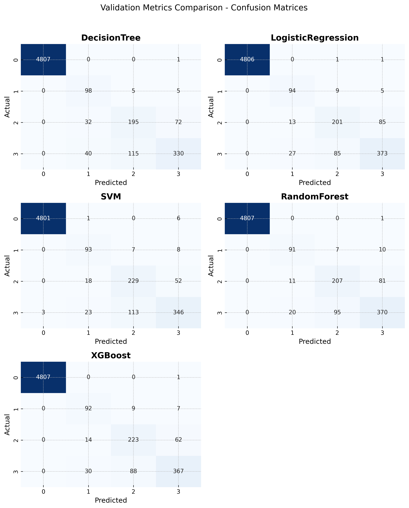

We train all of the models using a grid of parameters and we evaluate them using ROC-AUC

The best model is the one with the highest ROC-AUC on the validation set.

We use ROC-AUC as the main evaluation metric because it is robust to class imbalance and evaluates the model's ability to distinguish between classes across all possible classification thresholds, rather than just relying on a single fixed threshold (like 0.5). (we use One-vs-Rest for multiclass classification)

# Neural Network

We have created a NN with 3 hidden layers [128, 64, 32] with ReLU activation function and dropout of 0.2 between the layers. We train the model using the Adam optimizer and the cross-entropy loss function. We use early stopping to prevent overfitting.

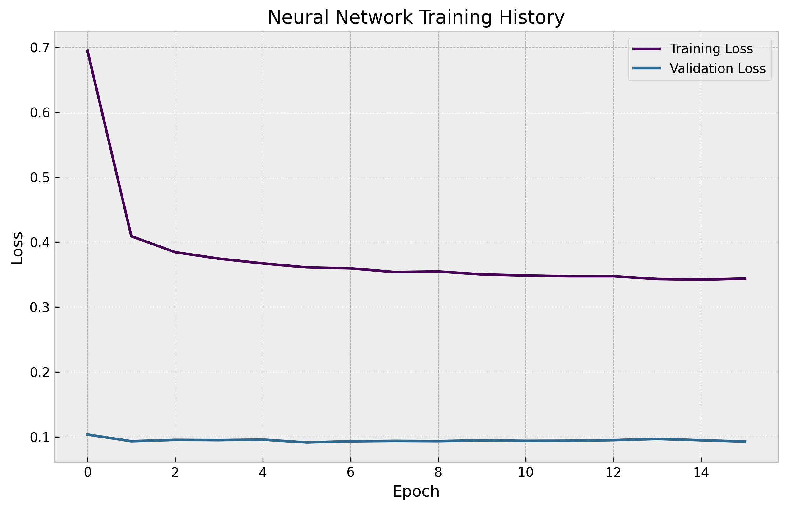
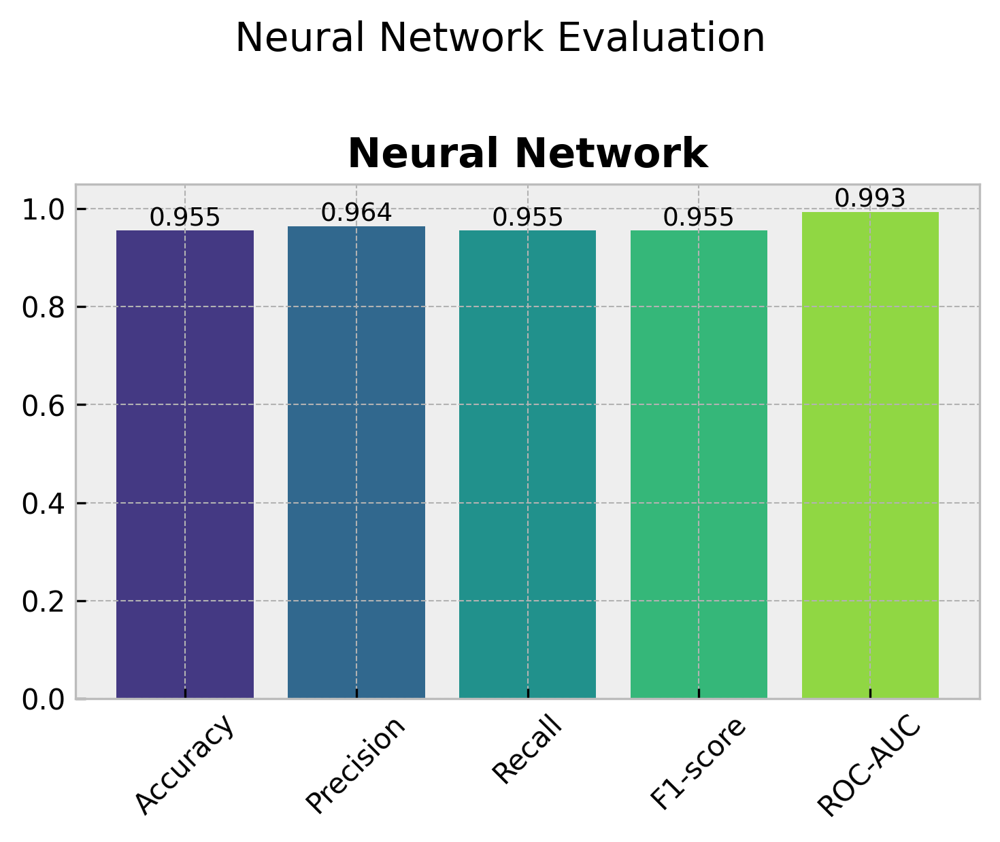
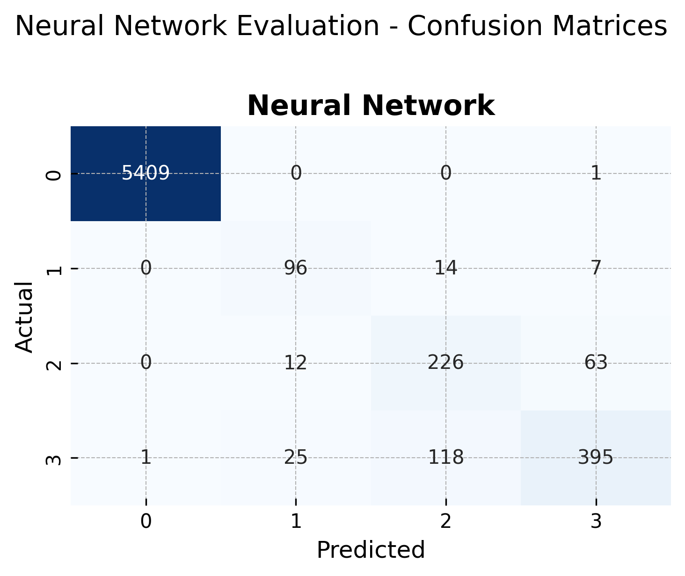

# Best Model

The pipeline automatically identifies and saves the overall "Best Model" by performing a head-to-head comparison between the optimal classical model (found via grid search) and the trained neural network. Both models are evaluated on the unseen test set using ROC-AUC as the primary metric (falling back to Accuracy if necessary). The winning model is persisted in the `/models` directory as `best_model.pkl` (for classical) or `best_model.pt` (for neural network), ensuring that the most reliable predictor is always available for subsequent inference or deployment.

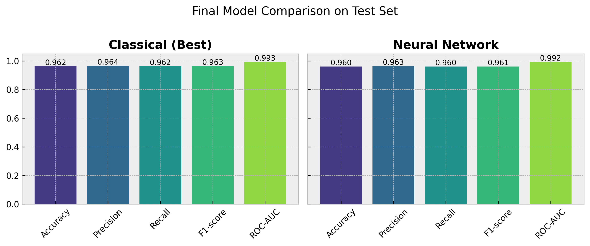
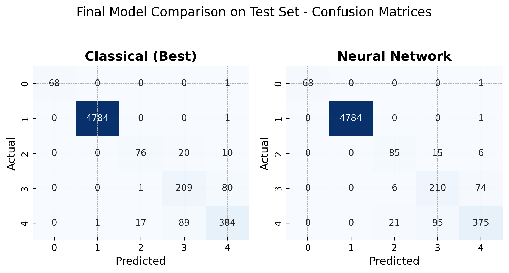


# Installation & Execution

Follow these steps to set up the environment and run the complete machine learning pipeline.

### 1. Clone the Repository

```bash
git clone https://github.com/dim-papach/AI-Handson-Assigments.git
cd AI-Handson-Assigments/hw1
```


# Setup Virtual Environment

## Using Poetry

```bash
poetry install
```

## Using venv

```bash
python3 -m venv venv
source venv/bin/activate
pip install -r requirements.txt
```

# Run the Pipeline

## With Poetry

```bash
poetry run python hw1/src/main.py
```

## With venv

Can also be used with poetry
```bash
./venv/bin/python hw1/src/main.py
```