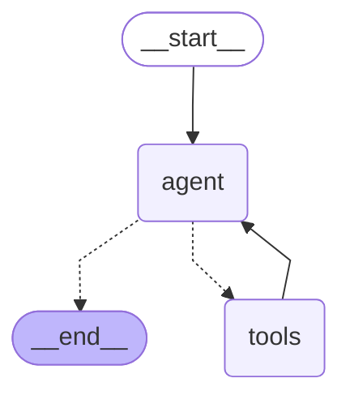

# HECATE Astrophysics Conversational AI Agent

## System Overview

This is a conversational AI agent that is able to answer questions about the HECATE catalog, a catalog of 100,000 galaxies. The agent is built using LangChain and multiple APIs including Gemini API, and uses a RAG system to retrieve relevant information from the catalog, as well as various other sources of astrophysical knowledge. 

The specific instructions for the AI agent are as follows:

```
SYSTEM PROMPT:
    "You are a helpful astrophysics AI assistant specializing in galaxy formation and nuclear activity. "
    "You have access to five tools:\n"
    "1. retrieve_domain_knowledge: Use this to answer factual or conceptual questions about the domain.\n"
    "2. predict_galaxy_class: Use this to predict the nuclear activity class of a galaxy given numerical features.\n"
    "3. dataset_stats: Use this to get summary statistics or distributions for any column in the HECATE dataset.\n"
    "4. calculator: Use this to evaluate mathematical expressions or perform unit conversions.\n"
    "5. csv_lookup: Use this to look up specific galaxies or subsets of rows from the dataset matching criteria.\n"
    "IMPORTANT DATASET SCHEMA:\n"
    "- The nuclear activity classification column is 'CLASS_SP' (0 = star forming, 1 = Seyfert, 2 = LINER, 3 = composite, -1 = unknown). Use exact case.\n"
    "- The distance column is 'D'.\n"
    "You MUST use these tools when appropriate. Do not guess information. "
    "Maintain a conversational tone and use previous context from the session memory if the user asks a follow-up question."
```

## Architecture

The agent is built using LangChain and uses a RAG system to retrieve relevant information from the HECATE catalog, as well as various other sources of astrophysical knowledge. The RAG system is implemented using LangChain and ChromaDB. We split the documents into chunks of 1000 characters with an overlap of 200 characters. Then we used the HuggingFaceEmbeddings model to embed the chunks and store them in the ChromaDB as a persistent vector store. The vector store is stored in the data/vector_store directory and the embeddings are created using the all-MiniLM-L6-v2 model. The RAG system is able to answer questions about the galaxies and the data of the HECATE catalog by retrieving the most relevant chunks for a given query and concatenating them into a single string to be passed to the LLM. 

We implemented 5 tools for the agent:
1. retrieve_domain_knowledge: Use this to answer factual or conceptual questions about the domain.
2. predict_galaxy_class: Use this to predict the nuclear activity class of a galaxy given numerical features.
3. dataset_stats: Use this to get summary statistics or distributions for any column in the HECATE dataset.
4. calculator: Use this to evaluate mathematical expressions or perform unit conversions.
5. csv_lookup: Use this to look up specific galaxies or subsets of rows from the dataset matching criteria.

The LangGraph framework is used to orchestrate the agent's workflow. It manages the state using a `StateGraph`, routing the conversation between the LLM and the tools using conditional edges. Additionally, we utilize LangGraph's `MemorySaver` checkpointer to maintain conversational memory across multiple turns, allowing the agent to remember context from previous interactions.

Here is the LangGraph architecture diagram for our agent:



The agent decides what tool to use based on the user's query and the context of the conversation. More specifically, the model chooses the appropriate tool based on two things:
1. **Tool Schemas (Pydantic):** When we bind the tools to the LLM using `llm.bind_tools(tools)`, LangChain automatically converts the Python function signatures and Pydantic input schemas into JSON schema representations. The LLM reads these schemas, along with the function docstrings, to understand exactly what inputs are required and what the tool does.
2. **System Prompt Guidance:** We explicitly describe the five available tools and their use-cases inside the agent's system prompt to enforce rules and prevent hallucination.

## Knowledge Base

I have chosen 12 pdf files from the domain of astrophysics to be used as a knowledge base for the RAG system. From those files 2 are wikipedia articles, 2 are publicly available books and 8 are research papers. One of the papers is the paper that introduced the HECATE catalog, the catalog that our agent is using and one is the original paper for the de Vaucouleurs classification scheme, which is a common way to classify galaxies from 1959 (I believe you should probably check out since astrophotography was not yet a thing back then and he had to draw the galaxies by hand).

## HW1 Model Integration

We used the model that we built in the previous homework assignment to predict the nuclear activity class of a galaxy. The model was XGBoost trained on the HECATE dataset. We also caried over the pipeline to process the data. We put the model and the pipeline in the tools directory and exposed them as a tool called predict_galaxy_class, which can be used to predict the nuclear activity class of a galaxy given numerical features.

## Example conversations

### RAG Example

```zsh
⚡poetry run python hw2/src/agent.py                                                         

Testing Agent with gemini (type 'quit' to exit)...

You: According to the literature, what is the de Vaucouleurs classification scheme?
Warning: You are sending unauthenticated requests to the HF Hub. Please set a HF_TOKEN to enable higher rate limits and faster downloads.
Loading weights: 100%|███████████████████████████████████████████████████████| 103/103 [00:00<00:00, 9151.85it/s]

Agent: The de Vaucouleurs classification scheme is a comprehensive notation system for classifying galaxies, building upon the revised Mt. Wilson-Palomar scheme. It incorporates additional galaxy types and subtypes suggested by work from Harvard, Lick, and Mt. Stromlo.

This scheme uses a three-dimensional representation to classify galaxies, accounting for objects with mixed characteristics and the progressive divergence and convergence of different galaxy sequences. The four main classes are ellipticals (E), lenticulars (SO), spirals (S), and irregulars (I). Within these, it further distinguishes between ordinary families (SA) and barred families (SB), as well as S-shaped varieties (S(s)) and ringed varieties (S(r)). The scheme highlights a continuous transition between these types, with the separation between sequences being most pronounced at the SO/a transition stage between lenticulars and spirals, and diminishing at the elliptical and irregular ends.

You: According to the literature, what is the Main Sequence of galaxies?
Loading weights: 100%|███████████████████████████████████████████████████████| 103/103 [00:00<00:00, 9373.46it/s]

Agent: The Main Sequence (MS) of star-forming galaxies (SFGs) is a fundamental relationship in astrophysics, representing a tight correlation between a galaxy's star formation rate (SFR) and its stellar mass (M⋆). This relationship has been observed to exist from redshift 0 up to approximately 6, making it a crucial tool for understanding galaxy evolution.
```

### Prediction Example


```zsh
AI-Handson-Assigments on  dev [!] 
⚡poetry run python hw2/src/agent.py

Testing Agent with gemini (type 'quit' to exit)...

You: predict the nuclear activity class for a galaxy with T=6.0, WF1=12.5, UT=14.2, U=15.1, R=14.3, G=14.8, I=14.0, Z=13.9, logM_HEC=10.5, logSFR_HEC=0.5, METAL=0.02, and AGN_HEC=Y.
IQR Capping Applied: 1 rows modified
Error Ratios Filtering Removed: 0 rows

Agent: Based on the provided data, the galaxy is predicted to be a Seyfert galaxy with a probability of 98.2%.

You: predict the nuclear activity class for a galaxy with T=6.0, WF1=12.5, UT=14.2, U=15.1, R=14.3, G=14.8, I=14.                                                                        

Agent: I can help you with that! However, I need a few more parameters to predict the nuclear activity class. Please provide values for:
*   `G` (g-band SDSS apparent magnitude)
*   `I` (i-band SDSS apparent magnitude)
*   `Z` (z-band SDSS apparent magnitude)
*   `logM_HEC` (Logarithm of total stellar mass)
*   `logSFR_HEC` (Logarithm of star-formation rate)
*   `METAL` (Metallicity)
*   `AGN_HEC` (Adopted activity classification: 'Y', 'N', or '?')

You: predict the nuclear activity class for a galaxy with T=10, WF1=12.5, UT=14.2, U=15.1, R=14.3, G=14.8, I=19.0, Z=13.9, logM_HEC=10.5, logSFR_HEC=0.15, METAL=0.03, and AGN_HEC=N.
IQR Capping Applied: 1 rows modified
Error Ratios Filtering Removed: 0 rows

Agent: Based on the information you provided, the galaxy is predicted to be star-forming with a probability of 100%.
```
## Installation and Execution

### 1. Install Dependencies

**Using Poetry (Recommended):**
```bash
poetry install
```

**Using venv:**
```bash
python3 -m venv venv
source venv/bin/activate
pip install -r requirements.txt
```

### 2. Configure Environment Variables
You need to provide your API keys for the LLM. Create a `.env` file in the root directory and add your keys:
```env
PREFFERED_API_KEY="your_key_here"
```

### 3. Run the Interactive Agent (Terminal)
To test the agent directly in your terminal with conversational memory:
```bash
# With Poetry:
poetry run python hw2/src/agent.py

# With venv:
python hw2/src/agent.py
```

### 4. Run the FastAPI Server
To launch the REST API endpoints (`/chat` and `/chat/stream`), run:
```bash
# With Poetry:
poetry run uvicorn hw2.src.api:app --reload

# With venv:
uvicorn hw2.src.api:app --reload
```
You can then access the interactive Swagger UI at [http://127.0.0.1:8000/docs](http://127.0.0.1:8000/docs).

### Example API Call

```zsh
⚡curl -N -X POST "http://localhost:8000/chat/stream" -H "Content-Type: application/json" -d '{"message": "Hi agent! Who are you?", "session_id": "test_session_1"}'
Greetings! I am Johannes Kepler, an astrophysics AI assistant. I specialize in galaxy formation and nuclear activity, and I'm here to help you explore the cosmos with the tools at my disposal. How may I assist you today?%
```


## Tasks
A quick overview of the tasks.

### 1. Knowledge Base & RAG System

The project aims to undestand how galaxies are classified and what are their properties. For this reason we used the HECATE catalog, which contains information about 100,000 galaxies. For our model to be able to answer questions about the HECATE catalog, we used a RAG system to retrieve relevant information from the catalog. The knowledge base we provided to the model contains articles, papers and books about galaxies, all of them in pdf format.

The RAG system is implemented using LangChain and ChromaDB. We split the documents into chunks of 1000 characters with an overlap of 200 characters. Then we used the HuggingFaceEmbeddings model to embed the chunks and store them in the ChromaDB as a persistent vector store. The vector store is stored in the data/vector_store directory and the embeddings are created using the all-MiniLM-L6-v2 model. The RAG system is able to answer questions about the galaxies and the data of the HECATE catalog by retrieving the most relevant chunks for a given query and concatenating them into a single string to be passed to the LLM.

#### RAG retrieval example

```zsh
# We use a custom test script to test the RAG system without the LLM agent
AI-Handson-Assigments on  dev [⇡!?] 
⚡poetry run python hw2/src/test_rag.py

Testing RAG System (Retrieval Only)...

Query: 'How is logSFR_HEC calculated?'

Warning: You are sending unauthenticated requests to the HF Hub. Please set a HF_TOKEN to enable higher rate limits and faster downloads.
Loading weights: 100%|███████████████████████████████████████████████████████████████████| 103/103 [00:00<00:00, 9419.85it/s]
=== Retrieved Context ===
logSFR 22u – Decimal logarithm of the W4-based SFR estimate (M ⊙ yr−1).
logSFR HEC – Homogenized log SFR (M ⊙ yr−1). Rescaling of SFR indicators is performed only here (Section 4.2.2).
SFR HEC flag – Flag indicating photometry source and SFR indicator used for logSFR HEC (Table 2).
logM HEC – Decimal logarithm of the M⋆ (M⊙).
logSFR GSW G Decimal logarithm of the SFR in GSWLC-2 (M⊙ yr−1).
logM GSW G Decimal logarithm of the M⋆ in GSWLC-2 (M⊙).
min snr – Minimum signal-to-noise ratio of the emission lines used for the activity classification ( class sp).
metal, flag metal – Metallicity [12 + log (O/H)] and its quality flag (Section 4.2.3).
class sp – Nuclear activity classification (Section 4.2.4): 0 =star forming, 1=Seyfert, 2=LINER, 3=composite, −1=unknown.
agn s17 E AGN classification in She et al. ( 2017): Y=AGN, N=non-AGN, ?=unknown.
agn hec – Combination of SDSS and She et al. (2017) classifications (Section 4.2.4): Y=AGN, N=non-AGN, ?=unknown.

---

logL TIR – Decimal logarithm of the TIR luminosity ( L⊙=3.83 × 1033 erg s−1).
logL FIR – Decimal logarithm of the FIR luminosity (L ⊙).
logL 60u – Decimal logarithm of the 60 μm-band luminosity (L⊙).
logL 12u – Decimal logarithm of the 12 μm-band luminosity (L⊙).
logL 22u – Decimal logarithm of the 22 μm-band luminosity (L⊙).
logL K – Decimal logarithm of the Ks-band luminosity (L⊙).
ML ratio – Mass-to-light ratio (Section 4.2.1).
logSFR TIR – Decimal logarithm of the TIR-based SFR estimate (M ⊙ yr−1).
logSFR FIR – Decimal logarithm of the FIR-based SFR estimate (M ⊙ yr−1).
logSFR 60u – Decimal logarithm of the 60 μm-based SFR estimate (M⊙ yr−1).
logSFR 12u – Decimal logarithm of the W3-based SFR estimate (M ⊙ yr−1).
logSFR 22u – Decimal logarithm of the W4-based SFR estimate (M ⊙ yr−1).
logSFR HEC – Homogenized log SFR (M ⊙ yr−1). Rescaling of SFR indicators is performed only here (Section 4.2.2).

---

1532 P. Popesso et al. 
MNRAS 519, 1526–1544 (2023) 
Figure 1. Left-hand panel: logSFR versus the Universe age in several bins of stellar masses. The data points indicate the SFR based on the MS estimates 
collected in this work. The solid lines show the best linear fit as in equation ( 9 ). Data points and lines are colour-coded as a function of the stellar mass bin as 
indicated in the figure. For clarity, the relations are artificially displaced by 0.4 dex from one another. Right-hand panel: α( logM ⋆ ) (upper panel) and β( logM ⋆ ) 
(lower panel) as a function of logM ⋆ . The red solid lines in both panels indicate the best-fitting relations of equation ( 9 ). The dashed line in the bottom panel 
shows the liner fit approximation as proposed in S14 . 
Table 2. The table lists the best-fitting parameters of equations ( 10 ) and ( 14 ) 
in the first two columns. The last column lists the best-fitting parameters of

=========================
```

### 2. Model as a Tool

On HW1 the best model we obtanied was XGBoost with a ROC-AUC of 0.9930. Also it was the best model in terms of correctly classifying the different classes. We saved it using pickle and used it as a tool in our RAG system to predict the class of a galaxy. We also saved the preprocessor used in hw1 to preprocess the data before passing it to the model. The saved pickle files are copied in the models directory. 

For the prediction tool, we apply the same preprocessing steps as in HW1 to the input data:
- `apply_iqr_capping`: Capping outliers using the 1.5 IQR rule.
- `apply_imputation`: Filling missing values using IterativeImputer.
- `filter_error_ratios`: Dropping rows with bad SNR.
- `compute_colors`: Engineering features like U-R, R-I.
- `apply_scaling`: Scaling the data using StandardScaler.
After preprocessing, the data is passed to the XGBoost model which predicts the class of the galaxy.

#### Example Prediction

```zsh
# We use a custom test script to test the prediction tool without the LLM agent
AI-Handson-Assigments on  dev [⇡!?] 
⚡poetry run python hw2/src/test_prediction.py

Testing Prediction Tool (HW1 Model Wrapper)...

Input features provided to tool:
{'T': 6.0, 'WF1': 12.5, 'UT': 14.2, 'U': 15.1, 'R': 14.3, 'G': 14.8, 'I': 14.0, 'Z': 13.9, 'logM_HEC': 10.5, 'logSFR_HEC': 0.5, 'METAL': 0.02, 'AGN_HEC': 'Y'}

IQR Capping Applied: 1 rows modified
Error Ratios Filtering Removed: 0 rows
=== Tool Output ===
Prediction: Seyfert (probability: 98.2%)
===================
```

### 3. Conversational AI Agent

The agent is composed of 2 main components:

- The Retrieval Tool, which is used to retrieve relevant information from the knowledge base from Task 1.
- The Prediction Tool, which is used to predict the class of a galaxy from HW1's best model.

We have also added a conversation memory to the agent, so that it can remember the previous turns in the conversation.

### Example Conversations

```zsh
# I use groq since my Gemini tokens expired for the day
⚡poetry run python hw2/src/agent.py

Testing Agent with groq (type 'quit' to exit)...

You: What are the main indicators that a galaxy has the "Seyfert" classification?
Warning: You are sending unauthenticated requests to the HF Hub. Please set a HF_TOKEN to enable higher rate limits and faster downloads.
Loading weights: 100%|██████████████████████████████████████████████████████| 103/103 [00:00<00:00, 12138.27it/s]

Agent: The main indicators that a galaxy has the "Seyfert" classification include:

* Optical properties, such as emission lines and continuum emission
* IR indicators, such as IRAS and WISE photometry
* Spectroscopic data, which can be used to estimate the metallicity of the galaxy and characterize its nuclear activity
* Clustering properties, which are similar to those of QSOs but with lower luminosities
* Membership in groups and clusters, with a high probability of being in these environments
* Central galaxy fraction in the MS region, which can be identified using IR-selected galaxy catalogs and SFR estimates.

It's worth noting that the classification of a galaxy as a Seyfert is based on a combination of these indicators, and different studies may use different criteria to identify Seyfert galaxies.

You: what other classes do we have on the HECATE catolog beside this one?
Loading weights: 100%|██████████████████████████████████████████████████████| 103/103 [00:00<00:00, 10689.43it/s]

Agent: The HECATE catalog includes several classes of galaxies, including:

* Seyfert galaxies
* Star-forming galaxies
* LINER (Low-Ionization Nuclear Emission-Line Region) galaxies
* Composite galaxies (which exhibit both star-forming and AGN activity)
* Non-AGN galaxies

These classes are based on various indicators, such as optical and IR properties, spectroscopic data, and clustering properties. The HECATE catalog also provides additional information, such as distances, SFRs, and stellar masses, for each galaxy.

You: what was the first class I asked you about?

Agent: The first class you asked me about was the "Seyfert" galaxy classification. You wanted to know the main indicators that a galaxy has this classification.

```


### 4. FastAPI Endpoint

To start the FastAPI server, run the following command:

```zsh
poetry run uvicorn hw2.src.api:app --reload
```

### 5. Additional Tools

Since the dataset we are working with is a quite large (~10,000 galaxies), we need to provide the user with ways to easily find the data they are looking for. This is why we added the CSV lookup tool.

We also added the Dataset Statistics tool, which returns the statistics of the dataset.


Additionaly, since the dataset is numerical and each column has specific units of measurement, we added the Calculator tool, which can be used to perform calculations on the dataset.

#### Example Interaction

```zsh
⚡poetry run python hw2/src/agent.py

Testing Agent with gemini (type 'quit' to exit)...

You: Find the closest Star Forming galaxy in our dataset (D column)

Agent: The closest Star Forming galaxy in our dataset is PGC 44491 (UGC08091) with a distance of 2.0998.

You: give me the the sfr/mass ratio of this galaxy in log scale and in linear scale

Agent: It looks like the `logSFR_HEC` and `logM_HEC` values are not available for PGC 44491 in the dataset. Therefore, I cannot calculate the SFR/mass ratio for this galaxy.

You: give me the closest SF galaxy with both sfr and mass and calculate the sfr/mass in log and linear

Agent: The closest Star Forming galaxy with both SFR and stellar mass data is NGC 5238 (PGC 47853), at a distance of 4.4981.

For this galaxy:
*   log(SFR/Mass) = -9.0735
*   SFR/Mass (linear scale) = 8.443 x 10^-10

You: what is the average SFR of the dataset?

Agent: The average log(SFR) of the dataset is -0.0680.
```

## 6. Streaming Output

We have also implemented streaming output for the agent. This means that the agent will output the response in chunks as it is generated, rather than waiting for the entire response to be generated before outputting it. This is useful for long responses, as it allows the user to see the response as it is being generated.


